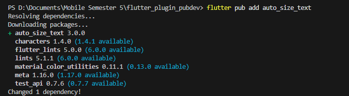
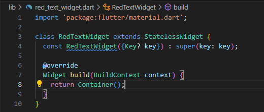
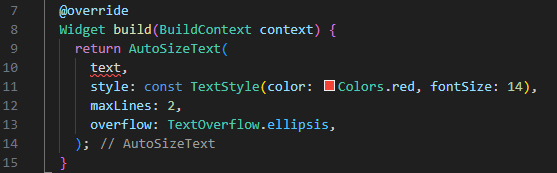
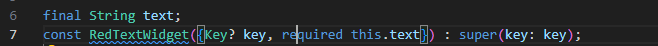
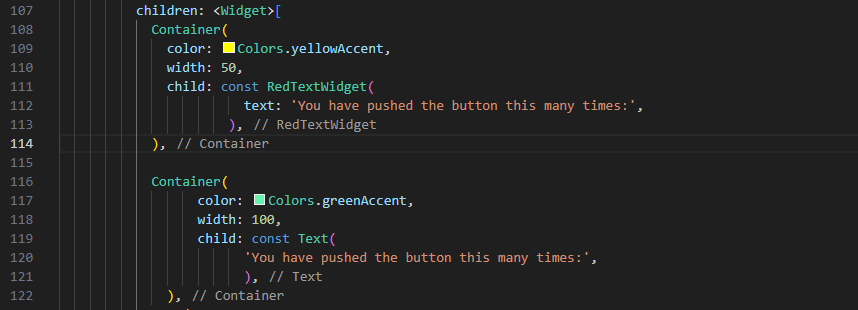
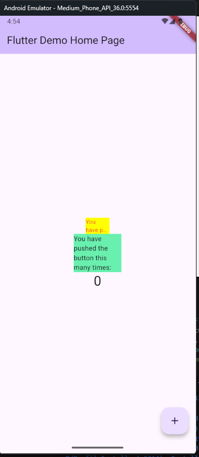

# flutter_plugin_pubdev

A new Flutter project.

## Getting Started

Menjalankan plugin auto_size_text menggunakan perintah berikut di terminal

Buat file baru bernama red_text_widget.dart di dalam folder lib lalu isi kode seperti berikut.

Untuk menggunakan plugin auto_size_text, ubahlah kode return Container() menjadi seperti berikut.

Tambahkan variabel text dan parameter di constructor seperti berikut.

Buka file main.dart lalu tambahkan di dalam children: pada class _MyHomePageState.

Run aplikasi tersebut dengan tekan F5, maka hasilnya akan seperti berikut.

This project is a starting point for a Flutter application.

A few resources to get you started if this is your first Flutter project:

- [Lab: Write your first Flutter app](https://docs.flutter.dev/get-started/codelab)
- [Cookbook: Useful Flutter samples](https://docs.flutter.dev/cookbook)

For help getting started with Flutter development, view the
[online documentation](https://docs.flutter.dev/), which offers tutorials,
samples, guidance on mobile development, and a full API reference.
